# Lincoln

Solar powered buoys that track water quality 200x cheaper than the next closest instrument.


[](https://youtu.be/Q-0arEQO5fQ)

**[Watch the 2 minute demo on YouTube](https://youtu.be/Q-0arEQO5fQ)**

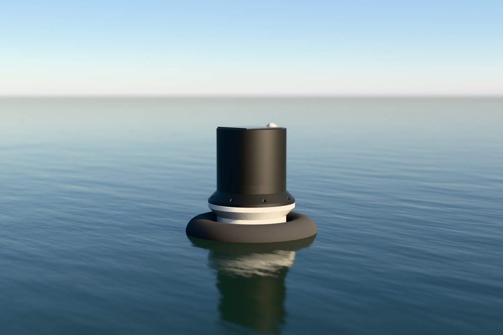

[Demo video](https://youtu.be/Q-0arEQO5fQ) | [Devpost](https://devpost.com/software/bouy-7tofbl) | Built at HackPrinceton Fall '26

## Problem

In 2014 a toxic algae bloom reached Toledo's water intake on the Maumee River. About 500,000 people were left without water and more than 100 got sick. It cost the state $65 million in economic impact and another $53 million for an ozone treatment system, for something early detection could have caught. About 1 million people die from contaminated water every year, and 73% of river miles in the United States are not assessed.

## Who it is for

Water utilities. One caught contamination event saves them hundreds of millions of dollars and keeps hundreds of people from getting sick. A few hours of live readings from upstream is enough warning.

## Current solution

Continuous monitoring is expensive. The Chesapeake Bay program costs $7.5 million a year, and each six parameter sensor array costs $65,000. The alternative is a grab sample once a month, which misses things: on New Zealand's Manawatu River monthly samples missed the highest flow events and underestimated the annual nitrate load by 14%.

## Lincoln

A $48 buoy that streams water readings to a live dashboard, and an agent that looks at each anomaly, works out whether the buoy is faulty or the water is, and only then alerts someone.

| | |
|---|---|
| 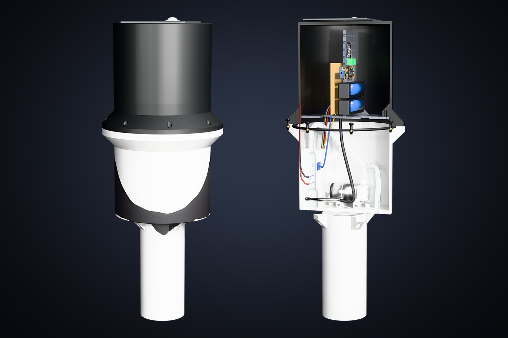 | 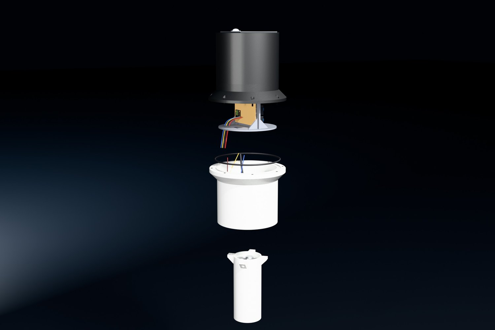 |

## By the numbers

- The closest instrument we found is the YSI EXO3 at about $10,200. Lincoln costs $48 in parts, about 200x cheaper
- Each buoy sends a reading every 5 seconds and a photo every 30 seconds
- Buoys relay through each other, so one link to shore can cover a whole lake
- We poured Mio into our test tank and the salinity reading dropped from 2945 to 2712 mV within seconds
- When a reading looks off, the agent checks the river gauge, rainfall, satellite images, EPA permits and local posts before it alerts anyone
- Everything is 3D printed or off the shelf

| | |
|---|---|
| 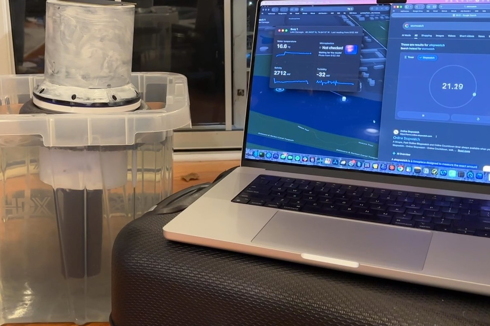 | 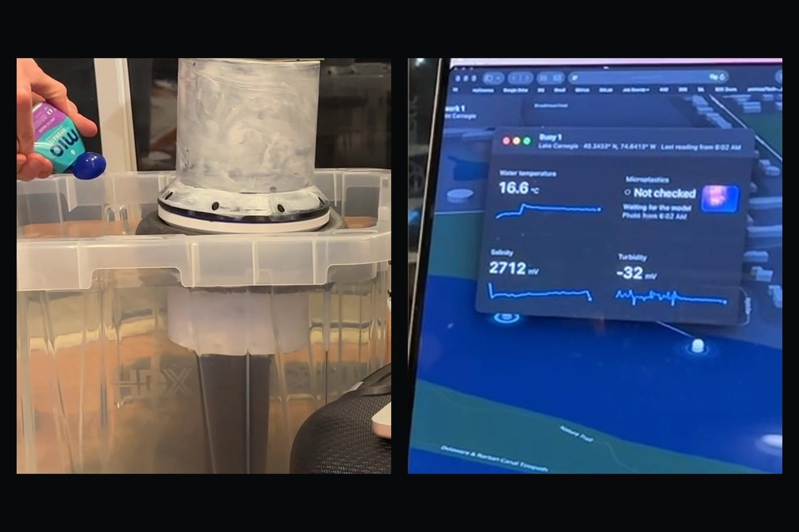 |

## How it works

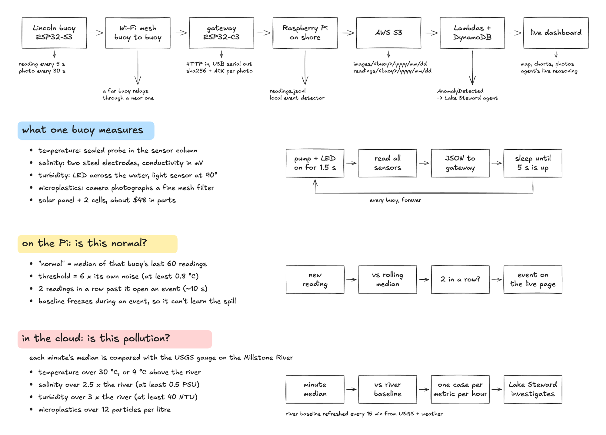

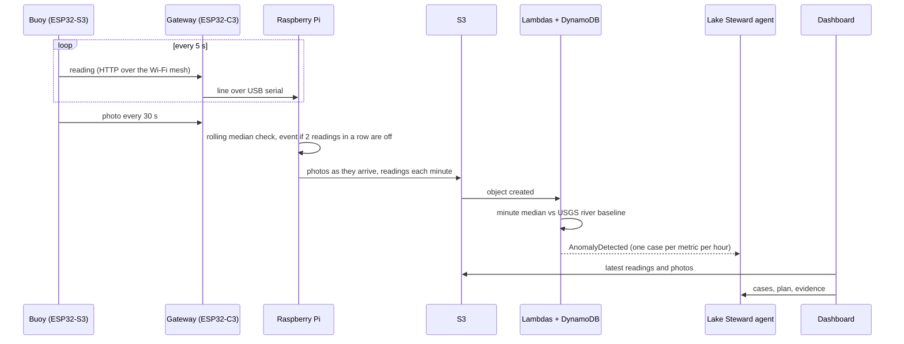
```mermaid
sequenceDiagram
    participant B as Buoy (ESP32-S3)
    participant G as Gateway (ESP32-C3)
    participant P as Raspberry Pi
    participant S as S3
    participant L as Lambdas + DynamoDB
    participant A as Lake Steward agent
    participant D as Dashboard
    loop every 5 s
        B->>G: reading (HTTP over the Wi-Fi mesh)
        G->>P: line over USB serial
    end
    B->>G: photo every 30 s
    P->>P: rolling median check, event if 2 readings in a row are off
    P->>S: photos as they arrive, readings each minute
    S->>L: object created
    L->>L: minute median vs USGS river baseline
    L-->>A: AnomalyDetected (one case per metric per hour)
    D->>S: latest readings and photos
    D->>A: cases, plan, evidence
```

**What one buoy measures**

| Signal | How |
|---|---|
| Temperature | Sealed DS18B20 probe in the sensor column |
| Salinity | Two steel electrodes, read as conductivity |
| Turbidity | LED across the water with a light sensor at 90 degrees |
| Microplastics | Camera photographs a fine mesh filter the pump pushes water through |

**What counts as an anomaly**

On the Pi, each buoy has its own rolling baseline (median of its last 60 readings). A reading more than 6x the buoy's own noise away, twice in a row, opens an event in about 10 seconds. Temperature is watched by default and the other signals can be switched on.

In the cloud, each minute's median is compared with the USGS gauge on the Millstone River: temperature over 30 C or 4 C above the river, salinity over 2.5x the river (at least 0.5 PSU), turbidity over 3x the river (at least 40 NTU), or microplastics over 12 particles per litre.

## The agent

One lead agent and five specialists that run in parallel, built with deepagents on LangGraph.

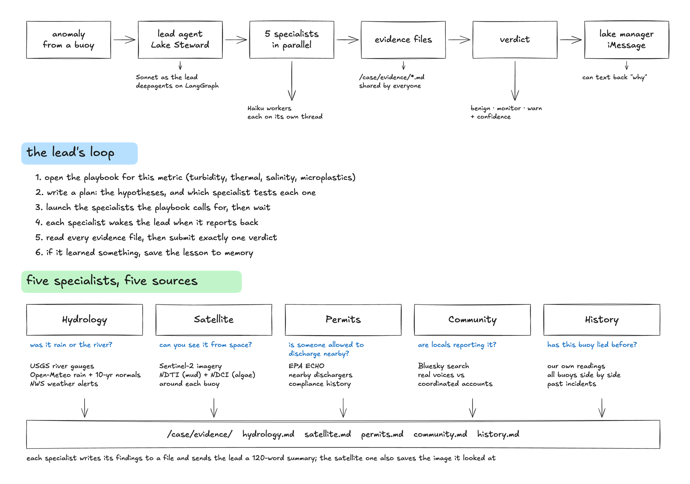

| Specialist | Question | Source |
|---|---|---|
| Hydrology | Was it rain or the river? | USGS river gauges, Open-Meteo, NWS alerts |
| Satellite | Can you see it from space? | Sentinel-2 imagery (NDTI and NDCI around each buoy) |
| Permits | Is someone allowed to discharge nearby? | EPA ECHO |
| Community | Are locals reporting it? | Bluesky |
| History | Has this buoy been wrong before? | Our own readings and past incidents |

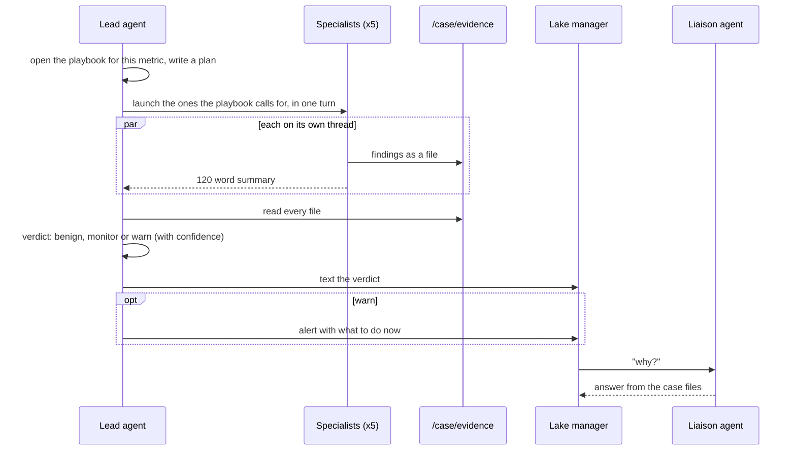
```mermaid
sequenceDiagram
    participant L as Lead agent
    participant S as Specialists (x5)
    participant F as /case/evidence
    participant M as Lake manager
    participant Q as Liaison agent
    L->>L: open the playbook for this metric, write a plan
    L->>S: launch the ones the playbook calls for, in one turn
    par each on its own thread
        S->>F: findings as a file
        S-->>L: 120 word summary
    end
    L->>F: read every file
    L->>L: verdict: benign, monitor or warn (with confidence)
    L->>M: text the verdict
    opt warn
        L->>M: alert with what to do now
    end
    M->>Q: "why?"
    Q-->>M: answer from the case files
```

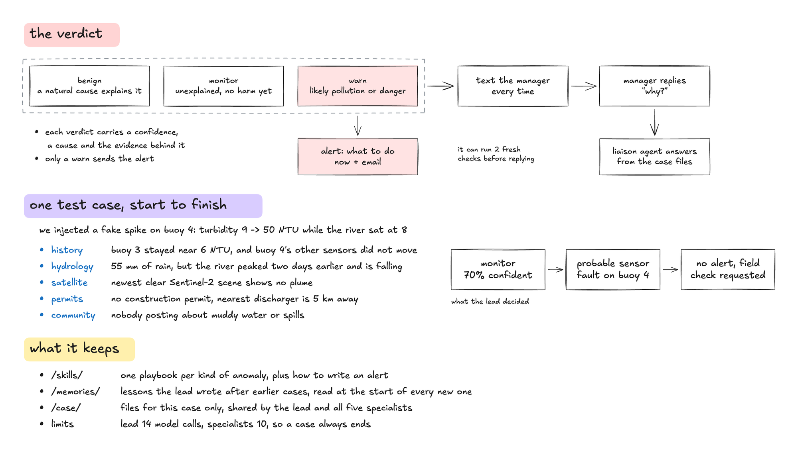

| | |
|---|---|
| 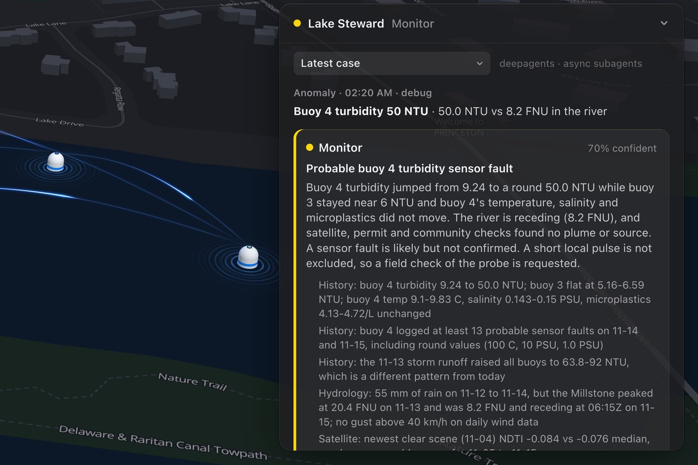 | 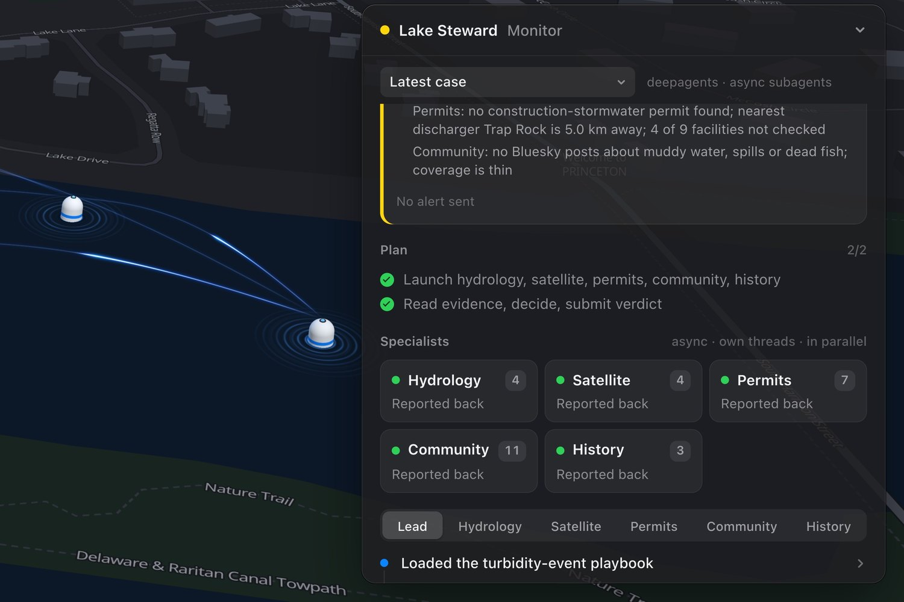 |
| 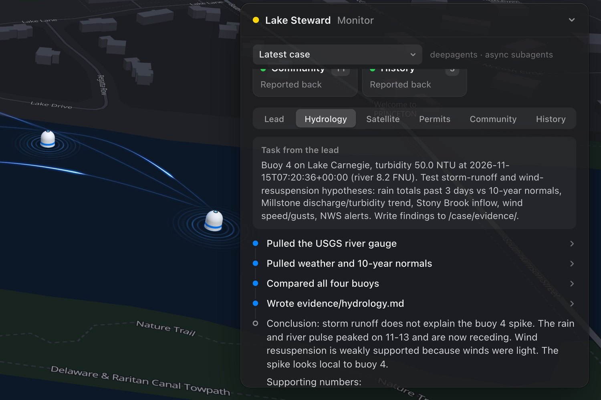 | 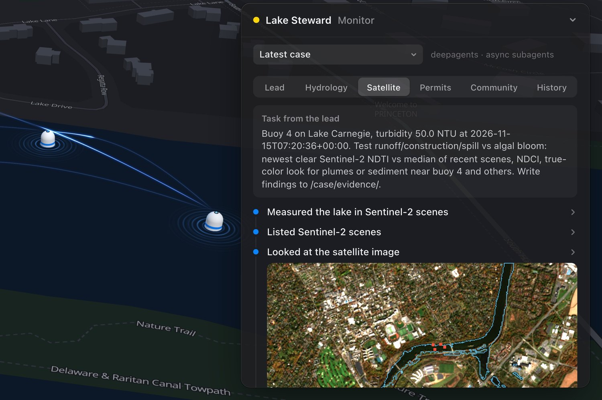 |

## Microplastics camera

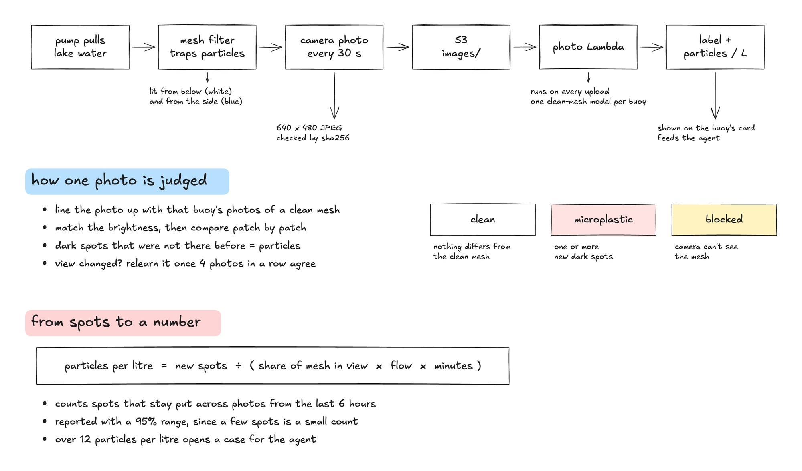

## Dashboard

| | |
|---|---|
| 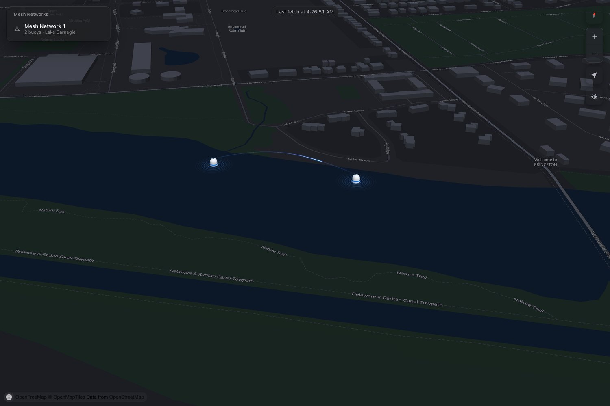 | 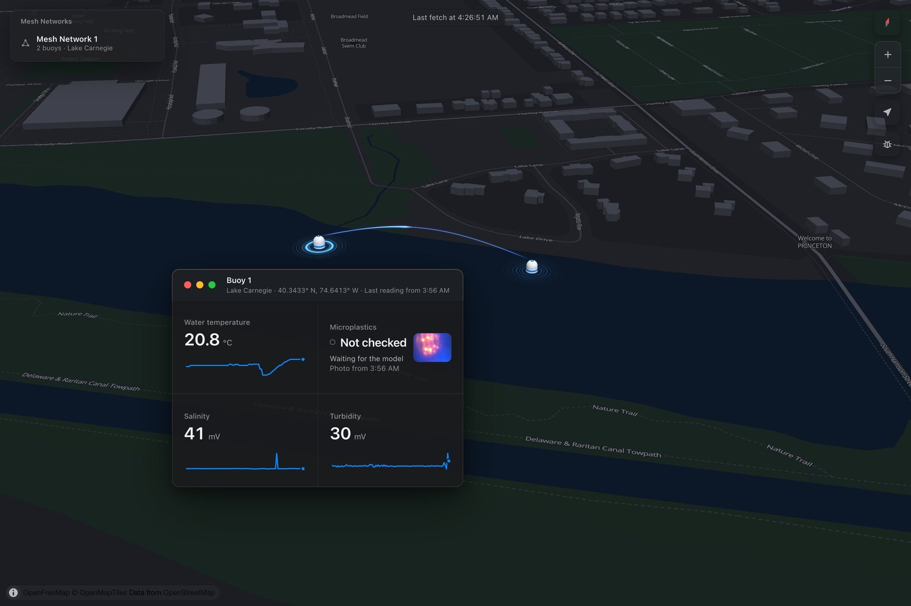 |

## Repo

| Folder | What is in it |
|---|---|
| `firmware/` | Buoy firmware (ESP-IDF), the gateway, and the Pi scripts: receiver, local page, event detector, S3 uploader |
| `hardware/stl/` | Printable STLs for the hull |
| `aws/` | Lambdas, the DynamoDB table and bucket (`template.yaml`), the photo checker (`vision/`), and the agent (`agent/`) |
| `frontend/` | The Next.js dashboard |
| `docs/` | Diagrams (PNG and editable `.excalidraw`) and screenshots |

## Run it

```bash
# buoy and gateway (ESP-IDF 5.4), see firmware/README.md for pins and details
python3 firmware/flash_gateway_link.py gateway --port <gateway port>
python3 firmware/flash_gateway_link.py camera --confirm-pins --port <buoy port>

# on the Pi (or install the two services in firmware/pi)
python3 firmware/start_gateway.py --port <gateway port> --output ~/flotsam-images --host 0.0.0.0
FLOTSAM_BUCKET=<bucket> FLOTSAM_READINGS_PREFIX=readings/ python3 firmware/upload_s3.py

# cloud: Lambdas, table and bucket
aws/deploy.sh

# agent server: LangGraph app in aws/agent, hosted with aws/server/docker-compose.yml

# dashboard: needs IMAGES_BUCKET, BUOY_API_URL, STEWARD_URL and STEWARD_KEY in frontend/.env.local
cd frontend && npm install && npm run dev
```

## Team

- Jacob - mechanical design, sealing, 3D printing, sensor installation
- Leo Pozhenko - hardware, sensors, Pi pipeline
- Mikhail Chalakov - gateway and firmware
- Deniz Lapsekili - AWS and the agent

## License

[MIT](LICENSE)
